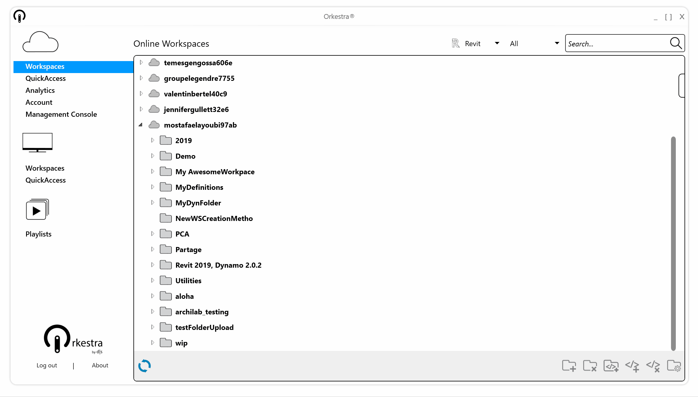

# Navigating the content

When logged to Orkestra through the Desktop app, you have access to all your content: both Dynamo and GrassHopper definitions. 

Since version 1.1.0, you can filter the content by Software version :

The information about software version is set inside the [Workspace Settings](what-is-a-workspace.md#software-compatibility-settings), where you can specify the version compatibility. 

