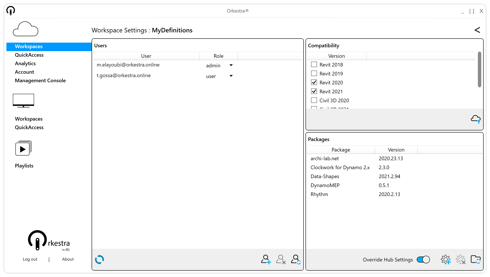

# Package Syncing

## The General Logic

As an administrator, you can [assign packages to a workspace](what-is-a-workspace.md#package-settings), and [grant people access to that workspace](what-is-a-workspace.md#add-users-to-the-workspace) through the Online Workspace Settings window:

If you make changes to the package settings, every user who has access to this workspace will see a button with an alert icon. Hovering over it will let them know which changes have been made :

.png>)

The user then only has to click that button to resync and make sure everything is up to date:

