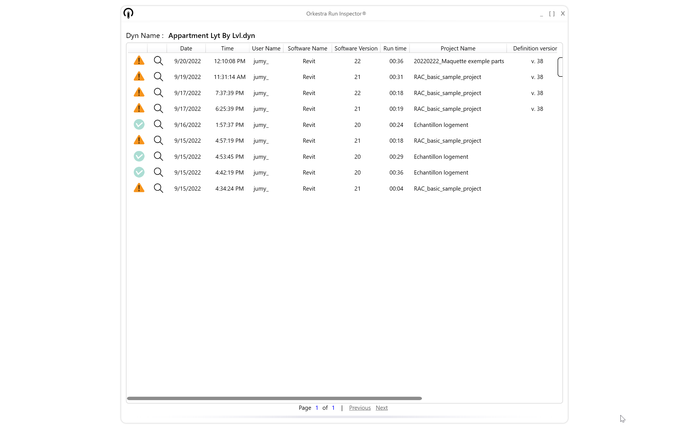

# Run Inspector

<figure><figcaption></figcaption></figure>

## What is the Run Inspector

The Run inspector has been introduced in Orkestra v.1.6.0 . This version of Orkestra records all the relevant information for you to troubleshoot any run!&#x20;

## How to enable to Run Inspector

Since the Run Inspector requires to record more information than our basic analytics, you'll have to enable it at your hub level. We did this because it is important for us to make sure that you are aware that all the data passing through your Dynamo tool nodes will be recorded, which may include project data or personnal data. Our privacy policy does cover this topic and you can rest assured that none of that data is sold or reused. It is stored for the sole purpose of providing you with the best possible toolset to manage your deployments!

<figure><figcaption>
Enabling the Run Inspector at Hub Level 
</figcaption></figure>

When the Run Inspector is enabled for the hub, the collection will start for all the content of that hub.

## How to access the Run Inspector for a definition

The Access is rather straightforward : you can right click any definition and access the Run Inspector. The first thing you will see is the history of runs for that specific definition with information about Revit version, Dynamo version, Document name, Run time, Date time, user name etc.&#x20;

<figure><figcaption>
The First Screen Of The Run Inspector Show You The Full History Of Runs For The Selected Definition
</figcaption></figure>

That screen also helps you get a first glimpse at which runs were performed with errors. You can then click the littlee magnifier to enter the Orkestra Editor and visualize the exact state of the graph after that run! So, from now on, if a user tells you "it doesn't work", all you have to do is check the run Inspector and see exactly what went wrong!&#x20;

<figure><figcaption></figcaption></figure>

