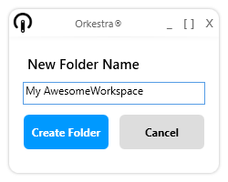

# What is a Workspace?

Workspaces are the **first level of subfolders inside a Hub**. A Workspace is a storage space where you can load and organize your Dynamo definitions. It is represented by a "  " in the "Online Workspaces" window. **If you are the owner/ an administrator of the Workspace**, you can view and edit its **settings**. **If you are the owner/ an administrator of a Hub**, you can add new Workspaces to it.

## To create a Workspace:

1. Select the Hub you wish to add a Workspace to in the **Online Workspaces** window
2. Press  
3. Select a name for your Workspace and confirm by clicking "Create Folder"

4. Your new Workspace will appear as a child of the Hub




## To edit the Workspace settings:

1. Select the Workspace in the "Online Workspaces" window 
2. Click on  . **This button will only be enabled if your are the owner/ an administrator of the Workspace**.


## User settings

In the Workspace Settings, you can specify which user gets access to its content. The list of users and their level of access is diplayed here:


**If someone has access to the parent Hub of the Workspace as a Hub Admin, they automatically have acces to the Workspace as well.**

You can easily manage the users through this window:

### Add users to the Workspace

1. Click on 
2. Enter the email address of the user you wish to add \(they need to have an Orkestra Online account\) and specify their role.


A **user** will be able to use the definitions through the Orkestra Revit Addin and view its properties but won't be able to download / open the script or edit its properties.   
An **admin** will be able to edit all settings of the Workspace and will also be able to download, open and edit definitions and their properties.

### Delete users from the Workspace

1. Select the user to be deleted in the list 
2. Click on 

### Updating a user's role:

1. Select a user in the list and use the dropdown menu to pick their new role

2. Click on  to update the user role information in the platform 


## Package Settings

The Workspace settings also let you sync a set of packages to be used for definitions located inside that Workspace. This means that when a script is launched through the [Orkestra Online Tab of the Orkestra Revit Addin](https://github.com/MostafaElAyoubi/Orkestra_Online/wiki/Orkestra-Online-Player-Tab), Orkestra switches the package environment automatically to match the parent Workspace's package settings. This lets you set the exact package versions that are required for your definitions, which makes deploying your content much easier and safer.

By default, the Hub settings are inherited. The list of packages is greyed out and the sync button is disabled. If you wish to set specific package settings for a Workspace, you first need to Override the Hub settings by switching on the  toggle and confirm that you want to override the settings.

Once the toggle is switched on, the modifications are enabled for the Workspace:


In order to synchronize a set of packages with your Workspace, you need to : 

1. Press the  button on the bottom right of the Hub settings window   
2. Browse to a folder containing the packages you wish to sync with the Hub


The content of that folder is the Dynamo package folders and must look something like this:


Once the sync if finished, you can see the list of packages and their versions displayed in the Orkestra Hub Settings window.

```diff
 A Workspace can contain sub folders, but there are no specific user or package settings at their level
```

