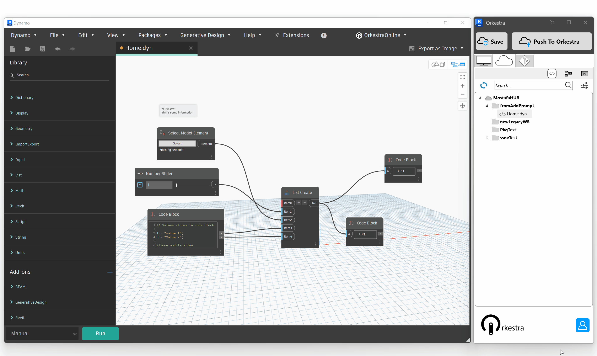
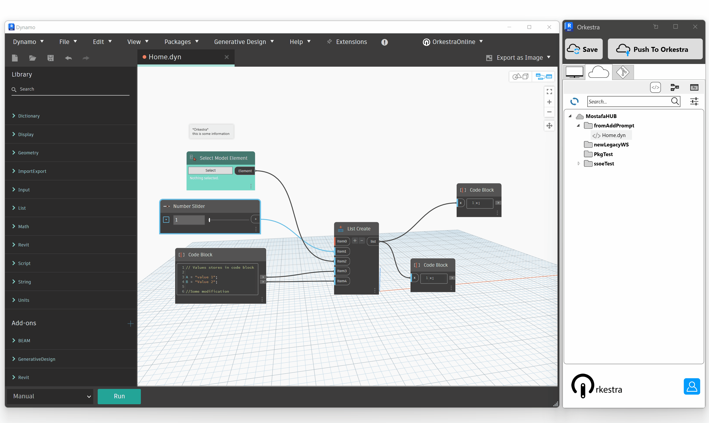
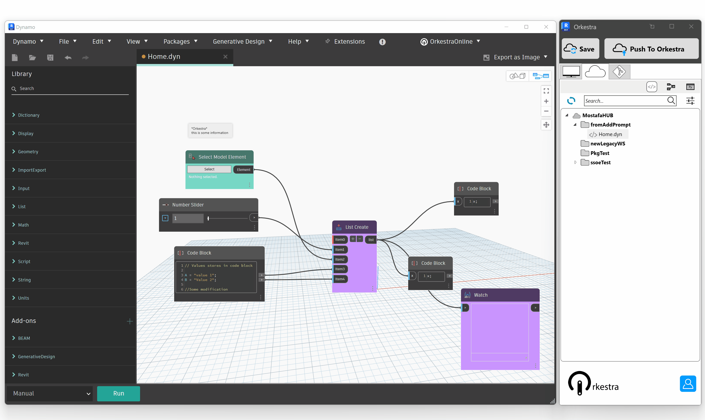
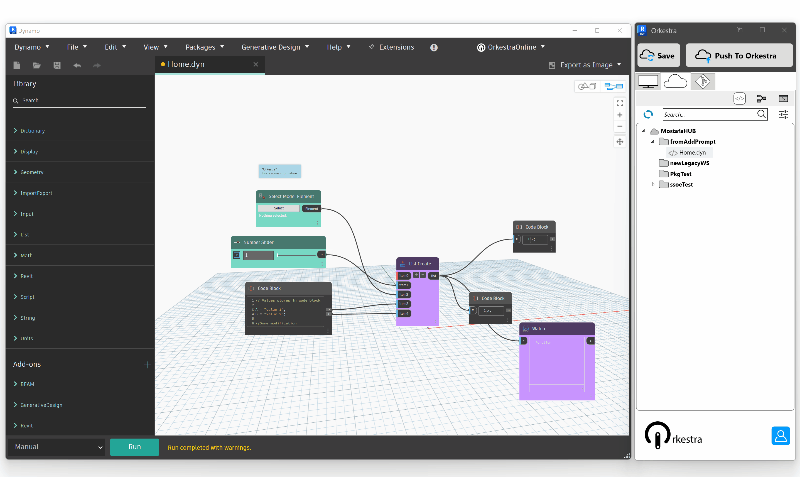

# Auto UI Form

### Visualize Inputs

The Orkestra ViewExtension for Dynamo lets you visualize the inputs nodes in your graph:

### Visualize Outputs

You can visualize the outputs as well. The difference with the Dynamo Player is that you can actually visualize any node that can be set as is input. Not only Watch Nodes!

### Auto UI Form Preview

Not only can you vizualise the input/output nodes on the canvas: you can also preciew the UI Form that your users will get when they run scripts through the Orkestra Player (in Revit ou Civil 3D):&#x20;

### Reorganize inputs in the Graph

Inputs in the Orkestra Auto UI Form follow the placement of the nodes on the canvas! This makes it very easy to reorganize them in the way that makes most sense for the tool :&#x20;

### Text Notes on your UI Forms

You can also add informational Text Notes on the Orkestra UI Forms by creating a TextNode in Dynamo that has the \*Orkestra\* header:&#x20;

