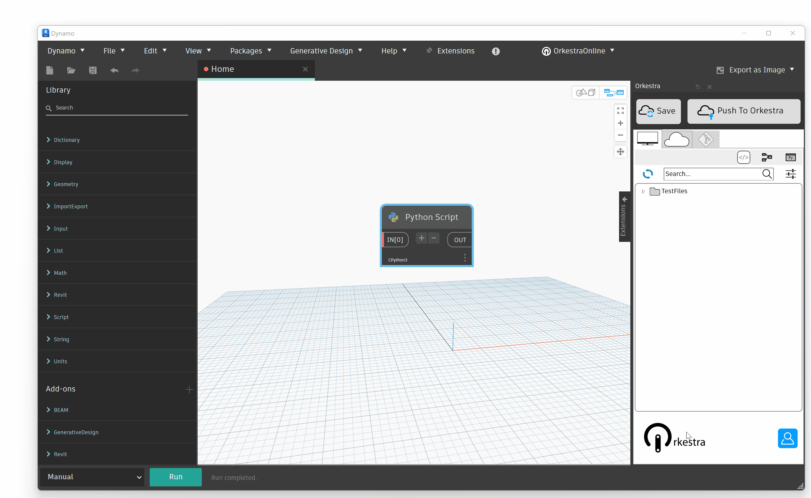
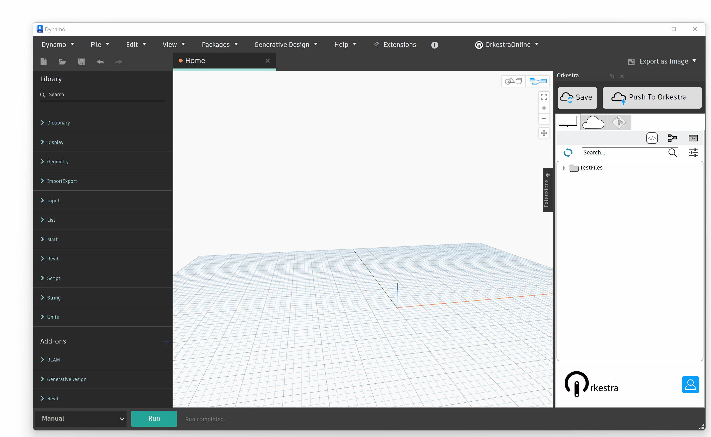
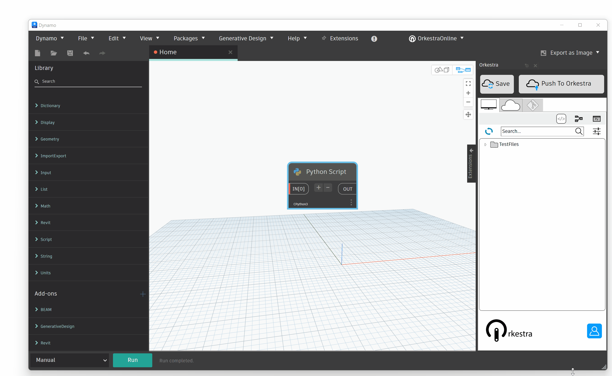
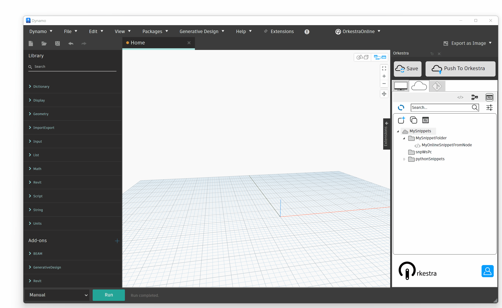

# Code Snippets

## Local Code Snippets

### Create a Local Code Snippet

#### From a Python Node

You can save the content of a Python node as a Local Code Snippet simply by using the context menu option as shown below:&#x20;

#### From the Orkestra Python IDE

Orkestra comes with a built in Python code editor (with syntax helpers etc.!). You can use it to create a python snippet from scratch and save it :

### Using a Local Code Snippet

#### By Copying Content in clipboard

There is an option to copy the content of the selected snippet to your clipboard. All you have to do is paste it where needed!

#### By Creating a Python Node

You can also use the python snippet to generate a python node on the canvass in one click:

## Online Code Snippets

### Create an Online Code Snippet

Code Snippets can also be saved online in order to be maintained more easily. PS : online noade snippets will soon be deployable so teams can share their most useful bits of code!

The creation of Online Node Snippets is 100% simial to local ones. You can create them through the context menu of a python node, or from the Orkestra Code Editor.&#x20;

#### From a Python Node

#### From the Orkestra Python Editor

### Using an Online Code Snippet

#### By Copying Content in clipboard

[See above](code-snippets.md#by-copying-content-in-clipboard)  (exactly the same as Local Code Snippets)

#### By Creating a Python Node

[See above](code-snippets.md#by-creating-a-python-node) (exactly the same as Local Code Snippets)
