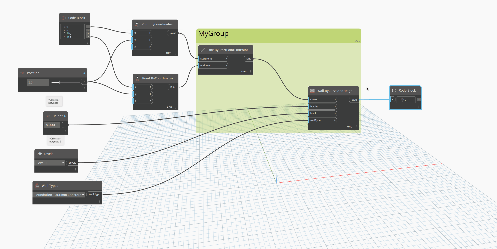

# Error Filtering

Orkestra provides you with powerful ways to track the usage of your tools. Tha analytics generated by Orkestra include user name, project name, run time, location etc. AND it also tells you whether the runs were performed successfully or with errors.&#x20;

With version 1.5.0, we've introduced a way to make the run status information as relevant as it can be, by including the usage of node tags that let you ignore some errors or focus on the state of specific nodes.

### Ignore Warnings for Specific Nodes

Node with the key word "\*OkIgnore\* in their name will be ignored when evaluating the status of a run. If nodes with the \*OkIgnore\* tag are in error state but the rest of the nodes in the graph are in a normal state, then the run will be considered as successful.

In order to add the key word easily, we have created some context menu functions. They will that all the selected nodes:

### Only Check the Satus of Specific Nodes (and ignore the rest)

Node with the key word "\*OkCheck\* in their name will force Orkestra to only check their status and ignore the rest. If all nodes with the \*OkCheck\* tag are in succes state and some nodes in the canvas are in error state,the run will still be considered as successful.

In order to add the key word easily, we have created some context menu functions. They will that all the selected nodes:

