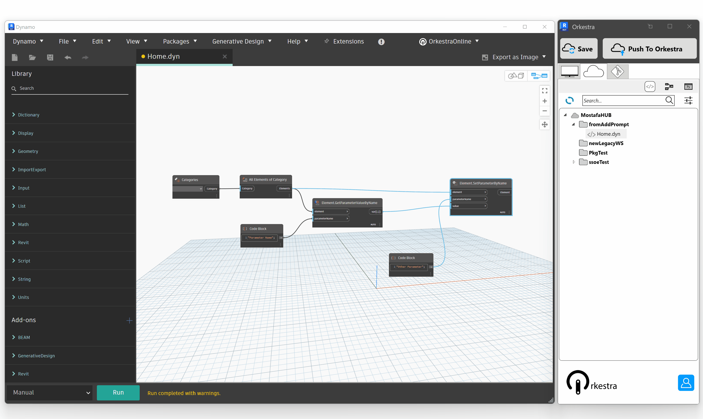
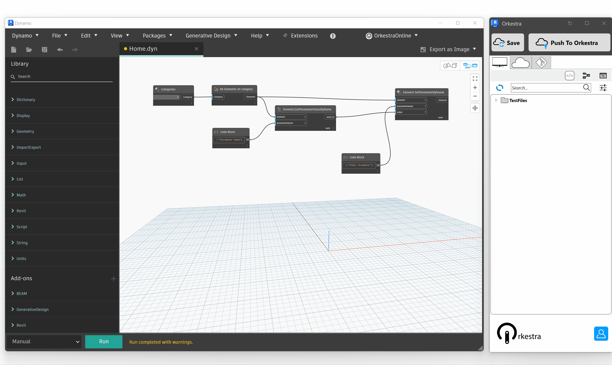
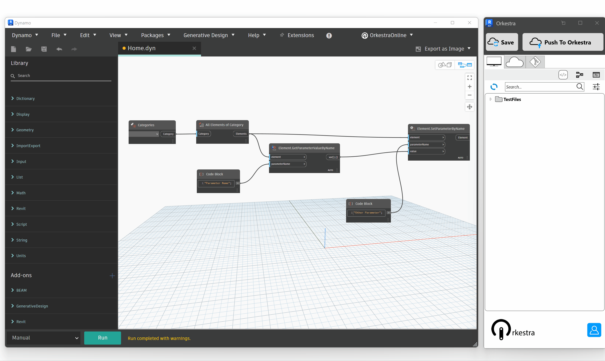
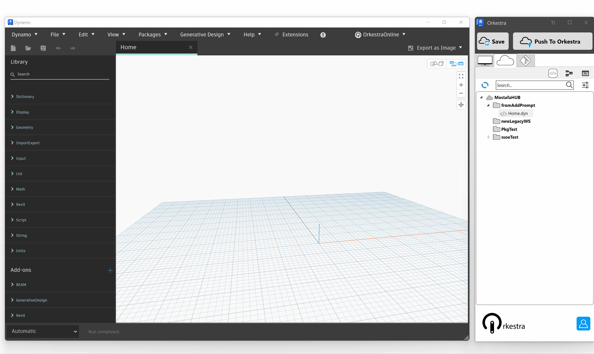

# Node Snippets

### Local Node Snippets

The local version of Orkestra (which is free - forever - ) allows you to locally save and store Node Snippets. Here's how to create and use them.

#### Save a Local Node Snippet

It all happens within the Dynamo canvas : select nodes and right click in order to access the Orkestra Context Menu.

#### Use a Local Node Snippet

Local Node Snippet locations must be set in the Node Snippet browser. You can set them up in the exact same way you set up local workspaces for definitions. You can then drag and drop snippets into the canvass:

### Online Node Snippets

Node snippets can also be saved online, which makes it easier to maintain them. You can then access them from any computer as long as you're logged into your account. PS: Node Snippets are not deployable yet, but they will be soon!

#### Save an Online Node Snippet

Saving an Online Node Snippet is quite similar to saving a Local one:&#x20;

#### Use an Online Node Snippet

Online Snippets are accessible through the Online Node Snippet Browser:

