# Orkestra View Extension Local Tab

The **Local Player Tab of the Orkestra Dynamo View Extension** is a very convenient **browser** for definitions located on your computer or on your server. 

**It does not require you to log in to Orkestra** or even have an internet connexion. It lets you **browse, search and open that are located on your computer** or your server.

The **Local Tab** is represented by this logo :  

## The Anatomy of the View Extension Local Tab

 

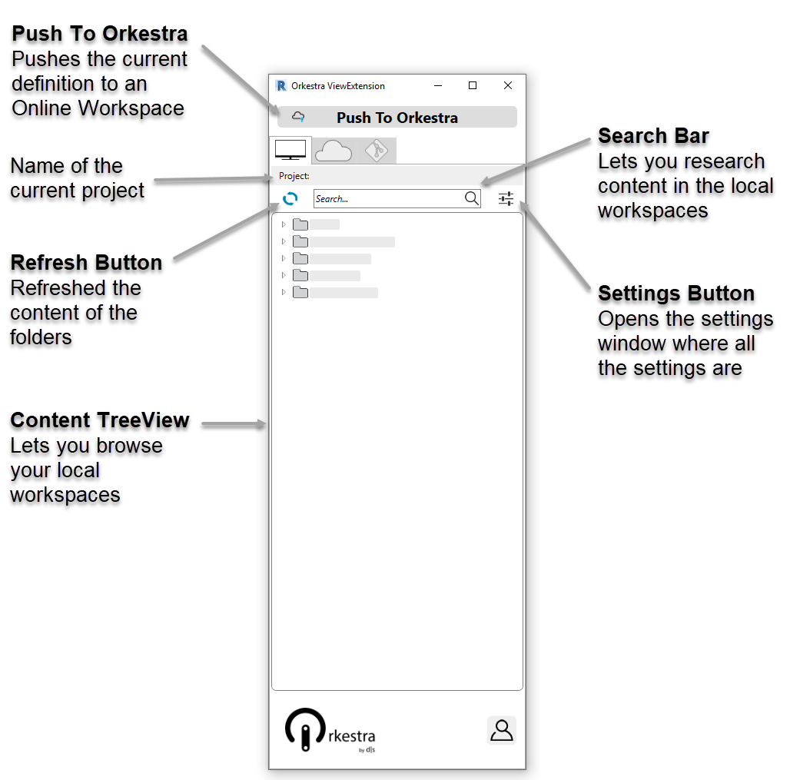

In the **Content TreeView**, folders are represented by a "" and Dynamo definitions by a "".

## Setting Local Workspaces

The Local Player Tab of the Orkestra Revit Addin is more convenient to use that the Dynamo Player because:

* It is a dockable pane that integrate better with Revit
* It lets you set up tree structures in a very easy way \(no need to continuously browse to different folders\)

  Here is how you can set up your local Workspaces:

### Adding a Local Workspace 

* **Through the Settings Window**

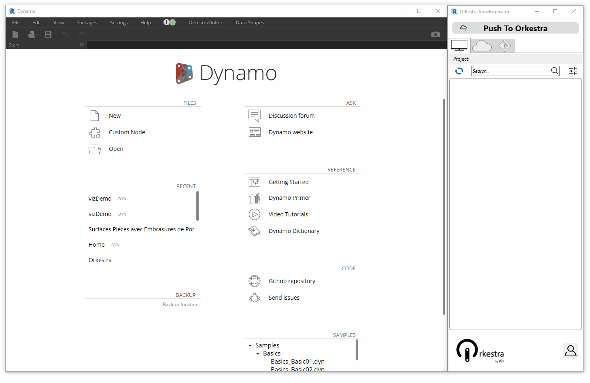

* **Right Click action**  

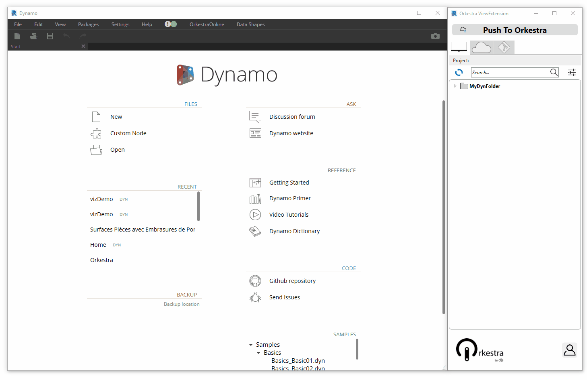

### **Removing a Local Workspace** 

* **Through the Settings Window**  

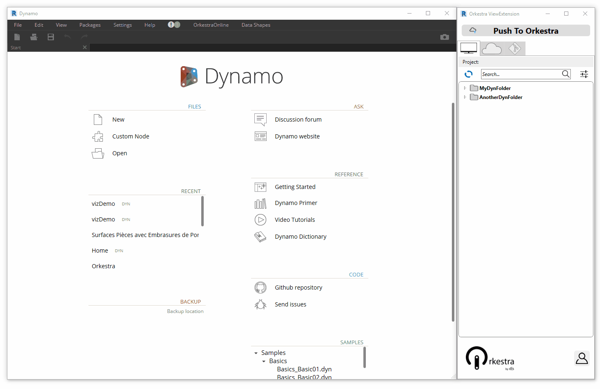

* **Right Click action**  

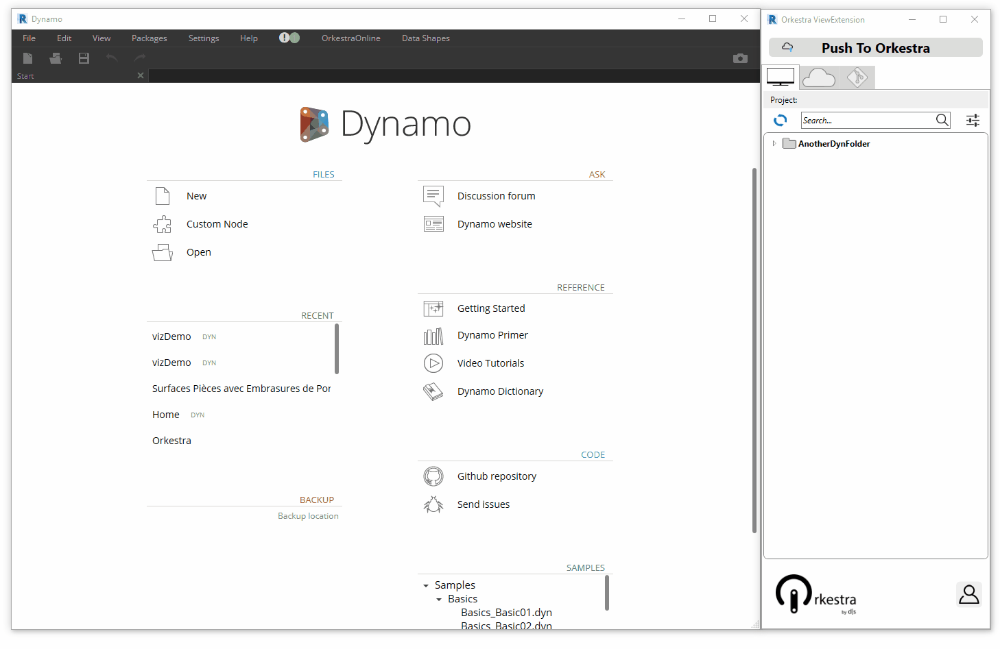

### Re-arranging Local Workspaces

### Using the Search Bar 

The search bar on the Orkestra View Extension Local Tab lets you search the content of all your local workspaces. The search is based on definition names:  

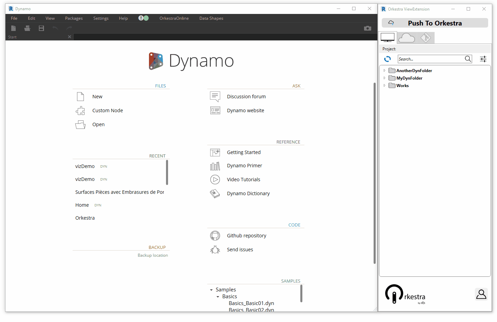

### Uploading a Local Definition to an Online Workspace 

The Orkestra View Extension Local Tab offers an easy way to upload definitions to your online workspaces. You can :

1. Open a definition in Dynamo and press ​ 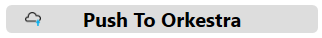 
2. A window with all the Hubs / Workspaces that you have an admin access to will appear. Select the workspace you wish to upload the definition 

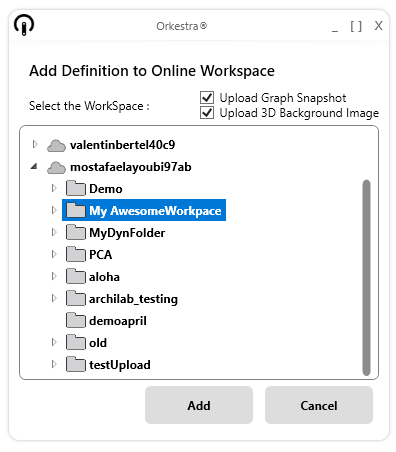

 3. There is an extra "**Upload Graph Snapshot**" option when uploading a definition from the Orkestra View     Extension. Checking it wil automatically add an image of the graph to the definition's associated metadata. It will be accessible from the properties pannel of the "Online Workspaces" window:  

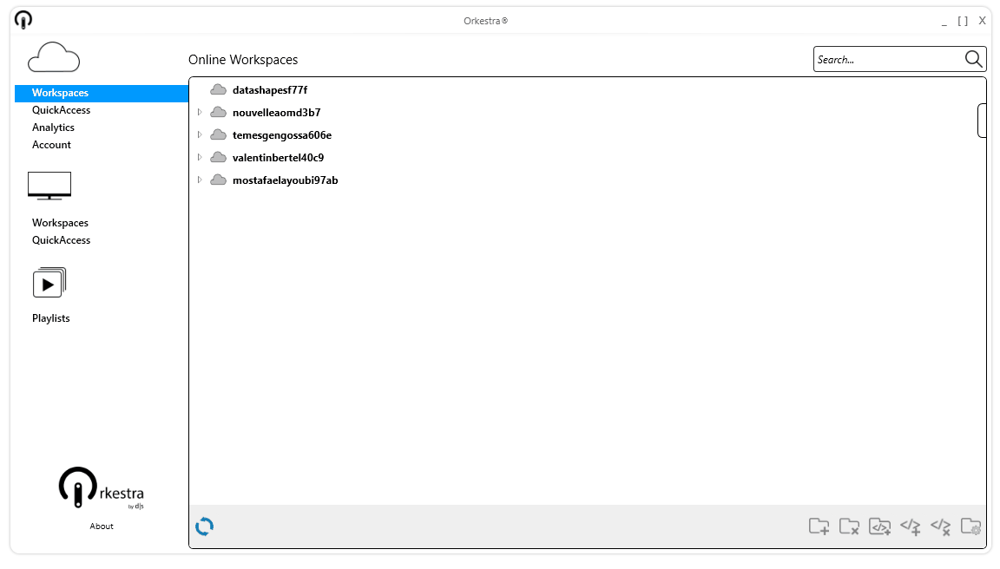

 4. There is an extra "**Upload 3D Background Snapshot**" option when uploading a definition from the Orkestra View Extension. Checking it wil automatically add an image of the Dynamo background geometry to the definition's associated metadata. It will be accessible from the properties pannel of the "Online Workspaces" window:   

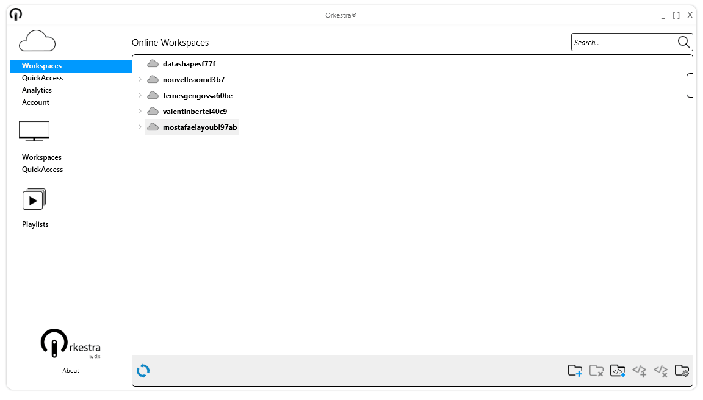

  5.  Once you've checked the  appropriate options and selected the Orkestra Online Workspace you wish to upload your definition to, click .

## Opening a Local Definition

The View Extension Local Tab give you a quick and conveinient access to all your local definitions. Just browse your local workspaces/ use the search bar and double click de definition to open it in Dynamo:  

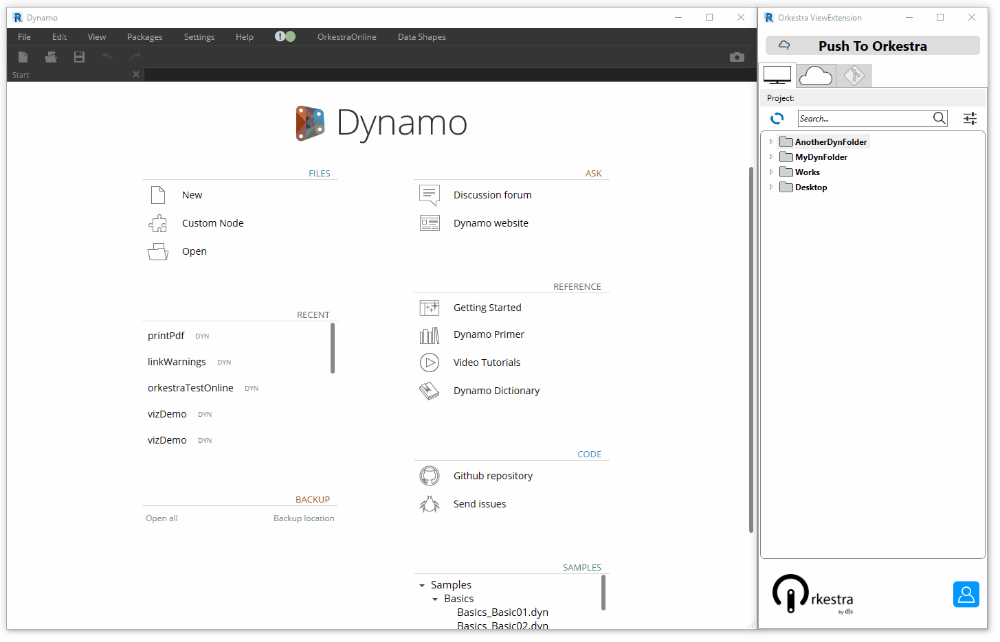

