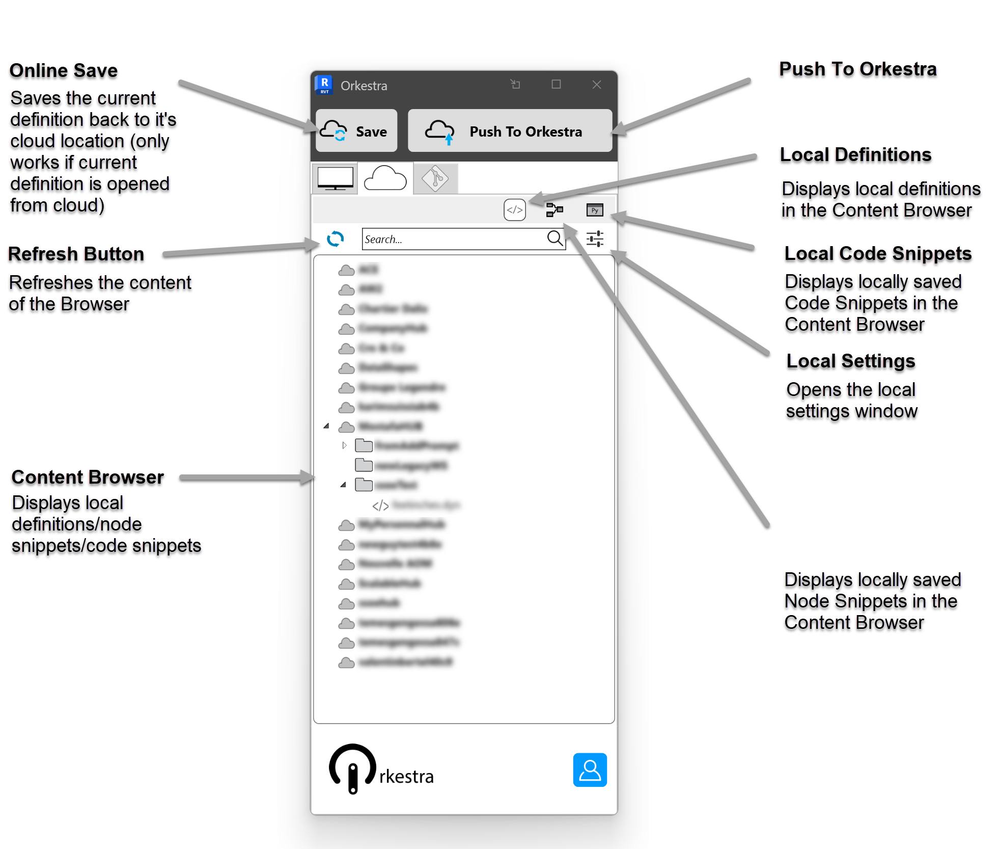
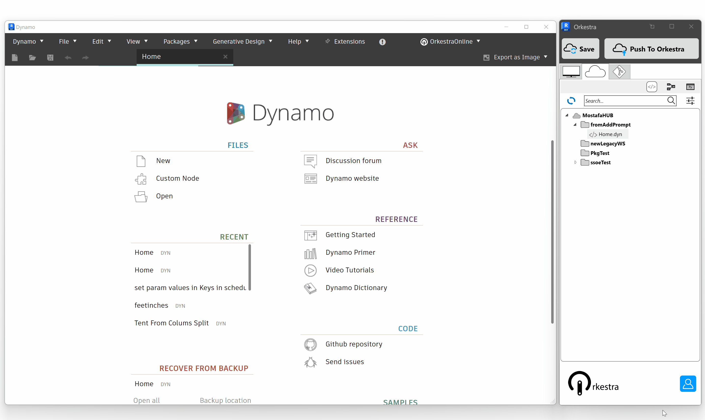

# Orkestra View Extension Online Tab

The **Online Tab of the Orkestra Dynamo View Extension**  lets you navigate and use all the online content that you have access to. **In order to enable the Online Tab, you need to** [**login**](https://datashapes.gitbook.io/orkestra-online/orkestra-revit-addin/login) **to your Orkestra Online account**.

The **Online Tab** is represented by this logo : 

## The Anatomy of the Online Player Tab 

## Online Hub and Workspace Settings 

You can access the same "Online Workspaces" window as in the Orkestra Desktop App directly from the settings button of the Online Player Tab of the Revit Addin. You just need to click :sing the Online&#x20;

From here, you can perform all the settings introduced in the following chapters:

* **​**[**What is a Hub**](../orkestra-desktop-app/what-is-a-hub.md)**​**
* **​**[**What is a Workspace**](../orkestra-desktop-app/what-is-a-workspace.md)****

## Accessing Online Definitions

### The Content 

The Online Tab displays all the **Orkestra Online content** that is yours or that you were given access to through the [**user settings**](https://datashapes.gitbook.io/orkestra-online/orkestra-desktop-app/what-is-a-workspace#user-settings) of the Orkestra Platform. It Refreshes automatically at login (or by pressing ), giving you constant access to the **latest** [**version**](https://datashapes.gitbook.io/orkestra-online/orkestra-desktop-app/versioning) **of the definitions**.

### The Versions

You can check out any version of an online definition through the ViewExtension's online tab:

### The Metadata

Metadata for each definition can be updated as you're working on a cloud definition through the OrkestraGit tab :&#x20;

### The Security 

When you deploy content through Orkestra Online, you decide the l**evel of access** you give to your users. If you grant people "**user**" access to a Workspace, they won't be able to open or modify it and it is never downloaded in their computers.

People who have "**admin**" access to your content will be able to download it, [**modify its metadata and associated documentation**](https://datashapes.gitbook.io/orkestra-online/orkestra-desktop-app/definition-metadata-and-documentation-1), and open it directly in Dynamo.&#x20;
