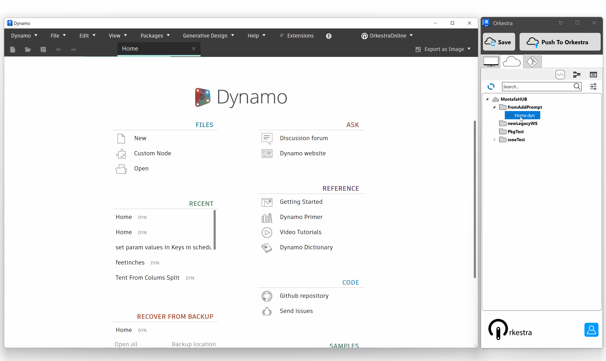

# OrkestraGIT

## Compare Different Versions of a same definition

Understanding what happened between two versions of a same definition might be time consuming. It gets even trickier if several people are working on the same files. Orkestra provides you with a way to quickly visualize differences (additions, deletions and modifications) between two versions of a tool. It even allows you to visualize text diff for code blocks and python nodes! Here's how to use it :

