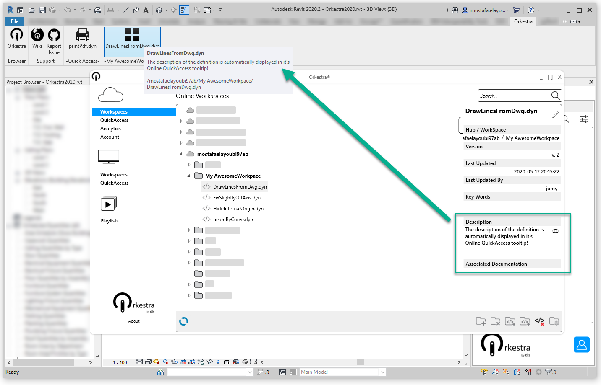

# Online QuickAccesses

## Introduction

Online QuickAccesses are yet another very **powerfull deployment functionnality**. It lets you create Revit ribbon buttons that:

* Always play the latest version of a definition and get automatically updated
* Use the right [**package environment**](../orkestra-desktop-app/what-is-a-workspace.md#package-settings)&#x20;
* Can easilly be managed and [**made accessible to all your users**](../orkestra-desktop-app/what-is-a-workspace.md#user-settings)&#x20;

All the management functionnalities for QuickAccesses can be found in the "Online QuickAccesses Settings" window of the Orkestra Online Settings:

1. Click &#x20;
2. Select the QuickAccess section in the Online Settings : &#x20;


## Creating an Online QuickAccess

Online QuickAccesses are grouped by Workspace. Therefore, before you create an Online QuickAccess for a definition, your first need to select the Workspace it is located in : &#x20;

```
You will only be able to create Online QuickAccess for definitions that you have
an "admin" access to.
```


Selecting a workspace in the list will display all the definitions it contains, including definitions located in subfolders:&#x20;


All you have to do to create que Workspace is:

1. Select the "Definition" in the list.
2. Press  to add it to the "QuickAccesses" list.
3. Push the modifications you made to the Orkestra Online Platform by pressing . By doing this, **you make the Online QuickAccess available to**[ **every user who has access to this workspace**](../orkestra-desktop-app/what-is-a-workspace.md#user-settings)**.**
4. Press  to refresh you Revit Ribbon.

Here is a video of the process: &#x20;


The QuickAccesses for definitions that are located in the same workspace are grouped in a pannel named after the workspace: &#x20;


## Deleting an Online QuickAccess

Deleting an Online QuickAccess can be done by performing the following steps:

1. Select the "QuickAccesses" in the list.
2. Press  to move it back to the "Definitions" list.
3. Push the modifications you made to the Orkestra Online Platform by pressing . By doing this, **you remove the Online QuickAccess for** [**every user who has access to this workspace**.](../orkestra-desktop-app/what-is-a-workspace.md#user-settings)
4. Press  to refresh you Revit Ribbon.

Here is a video of the process: &#x20;


## Customizing an Online QuickAccess

### Logo

Online QuickAccesses can be customized just like [**local QuickAccesses**](local-quickaccesses.md). The main difference is that this customization will be visible **for all users who have access to this Online Quickaccess**. This make your deployment much more user friendly. Here is how you can do it: &#x20;


### Tooltip

You can customize an Online QuickAccess tooltip simply by [**writing a description in it's metadata**](../orkestra-desktop-app/definition-metadata-and-documentation-1.md#description). This description will automatically appear in the Online QuickAccess tooltip: &#x20;



## Re-arranging Your Online QuickAccesses

### Re-arranging Positions

The position of the Online QuickAccess on the ribbon can be modified like shown in this video:


### Grouping

You can group Online QuickAccesses in a ribbon dropdown button. This allows better “space” management when you want to deploy a lot of definitions to your users as Online QuickAccesses: &#x20;


All you need to do to ungroup the Online QuickAccesses is swith of this toggle: &#x20;

You can also customize the icon for the ribbon dropdown: &#x20;


##
