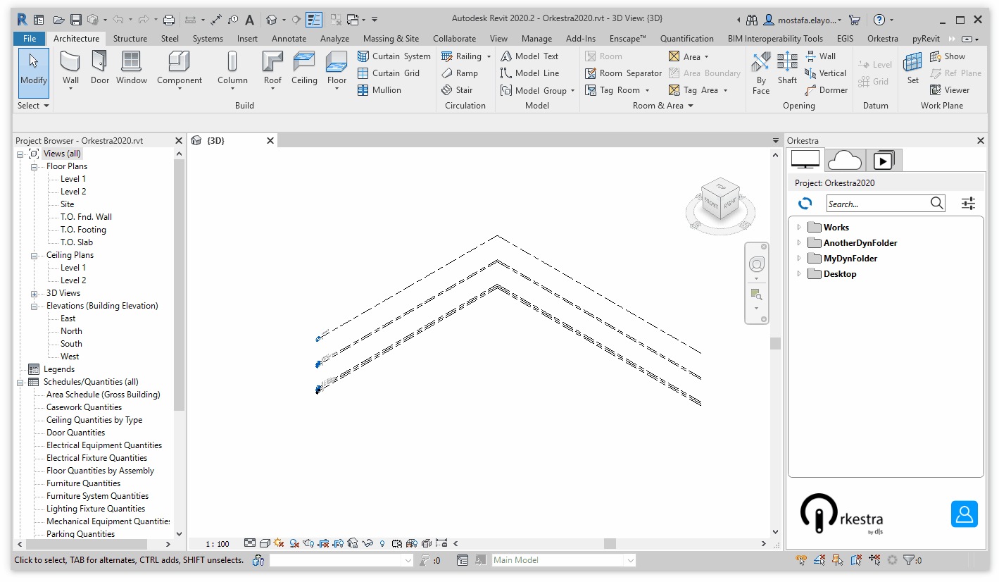

# Orkestra Local Player Tab

The **Local Player Tab of the Orkestra Revit Addin** is basically a Dynamo Player. **It does not require you to log in to Orkestra** or even have an internet connexion and lets you **play definitions that are located on your computer** or your server using your **local package settings**.

The **Local Tab** is represented by this logo : 

## The Anatomy of the Local Player Tab

In the **Content TreeView**, folders are represented by a " " and Dynamo definitions by a " ".

## Setting Local Workspaces

The Local Player Tab of the Orkestra Revit Addin is more convenient to use that the Dynamo Player because:

* It is a dockable pane that integrate better with Revit
* It lets you set up tree structures in a very easy way \(no need to continuously browse to different folders\)

  Here is how you can set up your local Workspaces:

### Adding a Local Workspace

* **Through the Settings Window**

* **Right Click action**

### **Removing a Local Workspace**

* **Through the Settings Window**

* **Right Click action**

### Rearranging Local Workspaces

### Using the Search Bar

The search bar on the Orkestra Local Player Tab lets you search the content of all your local workspaces. The search is based on the definition names:

 

