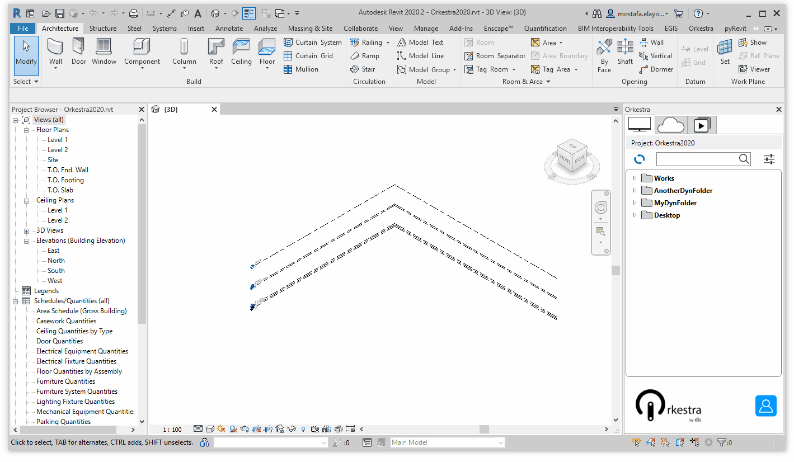
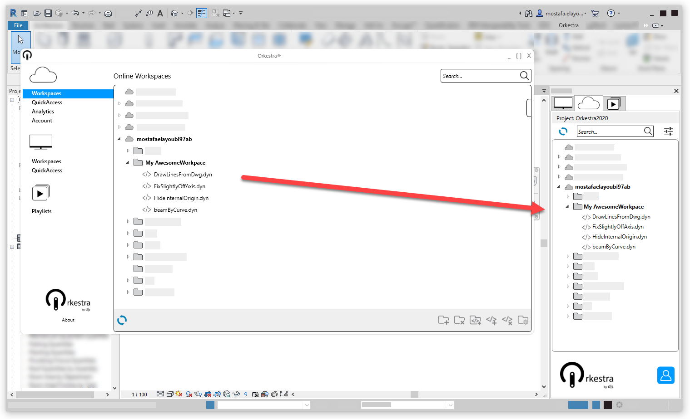
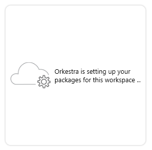

# Orkestra Online Player Tab

The **Online Player Tab of the Orkestra Revit Addin** is a Player that takes your online[ **Hub** ](../orkestra-desktop-app/what-is-a-hub.md)and [**Workspace**](../orkestra-desktop-app/what-is-a-workspace.md) ****settings into account when playing a definition. It lets you navigate and use all the online content that you have access to. **In order to enable the Online Player Tab, you need to** [**login**](login.md) **to your Orkestra Online account**.

The **Online Tab** is represented by this logo : 

## The Anatomy of the Online Player Tab


In the **Content TreeView**, [**Hubs**](../orkestra-desktop-app/what-is-a-hub.md) are represented by a "", [**Workspaces**](../orkestra-desktop-app/what-is-a-workspace.md) are represented by a "" , and Dynamo definitions by a " ".

## Online Hub and Workspace Settings

You can access the same "Online Workspaces" window as in the Orkestra Desktop App directly from the settings button of the Online Player Tab of the Revit Addin. You just need to click :



From here, you can perform all the settings introduced in the following chapters:

* \*\*\*\*[**What is a Hub**](../orkestra-desktop-app/what-is-a-hub.md)\*\*\*\*
* \*\*\*\*[**What is a Workspace**](../orkestra-desktop-app/what-is-a-workspace.md)\*\*\*\*

## Playing an Online Definition

The Orkestra Online Player Tab is **one of the most powerful things about Orkestra**. It may look like it is doing the same thing as the Local Player Tab but it actually is much more sophisticated.

### The Content

The Online Player Tab displays all the **Orkestra Online content** that is yours or that you were given access to through the [**user settings**](../orkestra-desktop-app/what-is-a-workspace.md#user-settings) of the Orkestra Platform. It Refreshes automatically at login \(or by pressing \), giving you constant access to the **latest** [**version** ](../orkestra-desktop-app/versioning.md)**of the definitions**.



### The Package Settings

The Online Player Tab [**uses the package settings**](../orkestra-desktop-app/what-is-a-workspace.md#package-settings) that were associated to the Hubs and Workspaces and **ensures that you have the appropriate dependencies loaded at each run**! Every time you play a definition through the Orkestra Online Player Tab, it detects the need to switch your package environment accordingly with the settings. When it does so, this window appears : 



This phase takes somewhere between a couple of seconds and a couple of minutes, depending on the number of packages you have associated to your Workspace. With a reasonable amount of packages, it shouldn't take more than 15 seconds. But it is optimized in a way that it only does so when the package environment needs to be changed. **This solves one of the most challenging problems of deploying Dynamo content at a large scale**. 

```text
WE STRONGLY ADVISE YOU TO KEEP THE NUMBER OF PACKAGES ASSOCIATED TO A WORKSPACE TO 
A MINIMUM (5 or less). Try and reduce that number to what is actually being used 
in your definitions. This will make the package environment shift much faster.
```

### Package Syncing

If the administrator of one of your [Hubs](../orkestra-desktop-app/what-is-a-hub.md) / [Workspaces ](../orkestra-desktop-app/what-is-a-workspace.md)updates the [packages settings](../orkestra-desktop-app/package-syncing.md), you'll be notified with a button that displays a warning icon. Hovering over that button will let you know which changes have been made. You only need to click that button to resync and make sure everything is up to date agin. _**Note that you won't be able to play any online definition if you are not up to date \(the Online Definition Browser will be disabled\) !**_


### The Analytics

Whenever a definition is played through the Orkestra Online Player Tab, **some valuable data is pushed to your Orkestra Online database**. That data is what you can see in the[ **Analytics**](../orkestra-desktop-app/analytics.md).

### The Security

When you deploy content through Orkestra Online, you decide the l**evel of access** you give to your users. If you grant people "**user**" access to a Workspace, they will only be able to play it. They wont be able to open or modify it and it is never downloaded in their computers. **The content is streamed**, securing the integrity of your work.

People who have "**admin**" access to your content will be able to download it, ****[**modify its metadata and associated documentation**](../orkestra-desktop-app/definition-metadata-and-documentation-1.md), and open it directly in Dynamo. When opening a definition in Dynamo through the Orkestra Online Player Tab, it is loaded with the package environment that was associated to it!

## Using the Search Bar

The search bar in the Online Player Tab lets you search definitions stored online. It doesn't only use the definition names but also their key words, making it much more efficient! This search method, associated with the advanced metadata and documentation, makes deployment much easier. 


