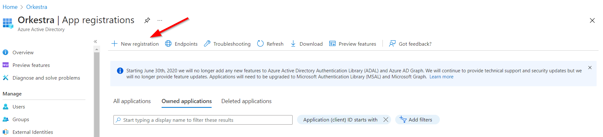
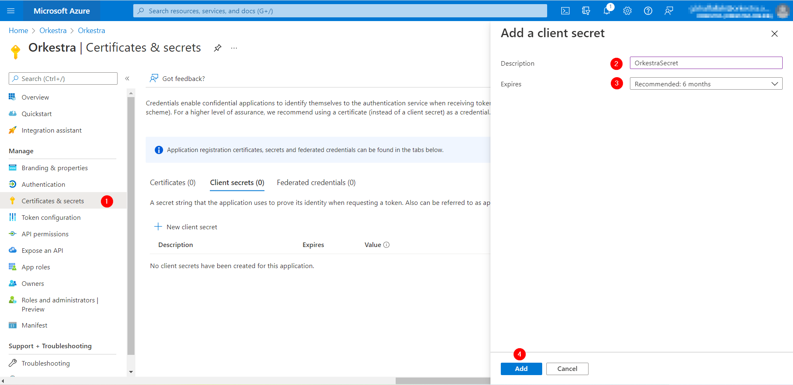
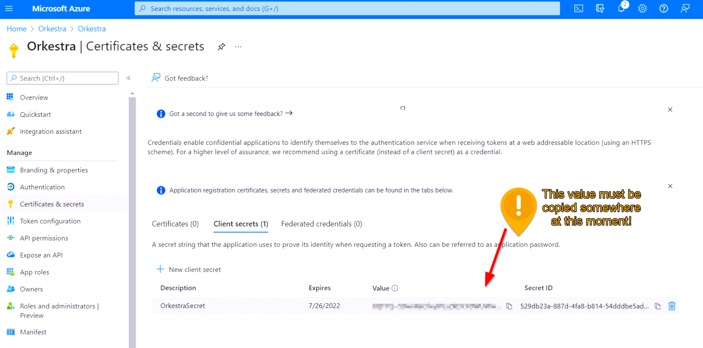
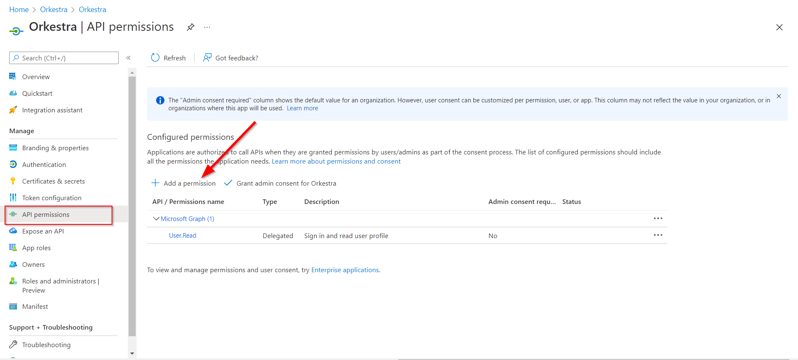
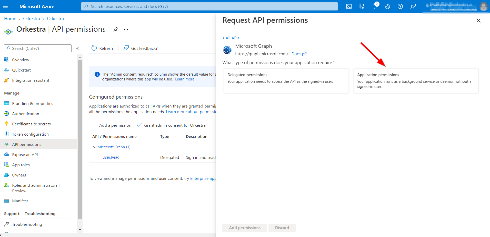
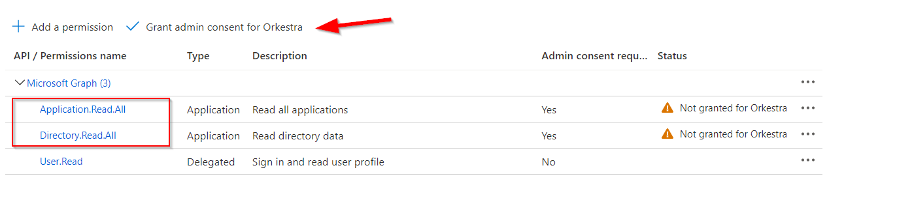
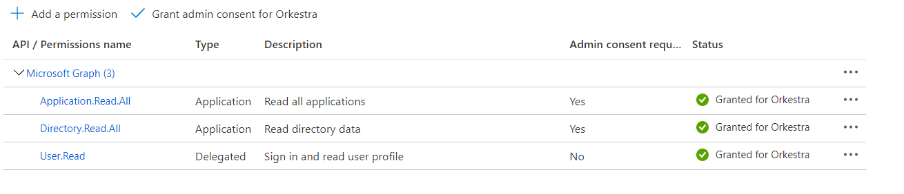
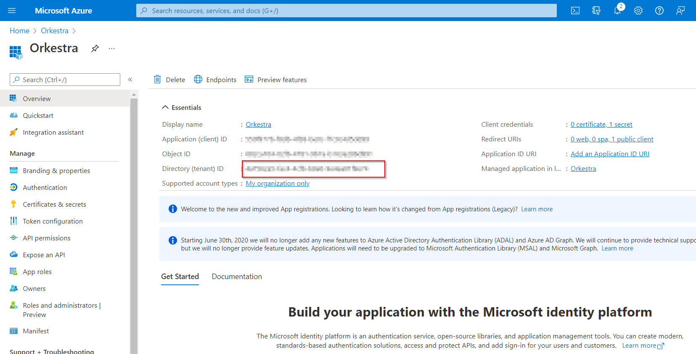
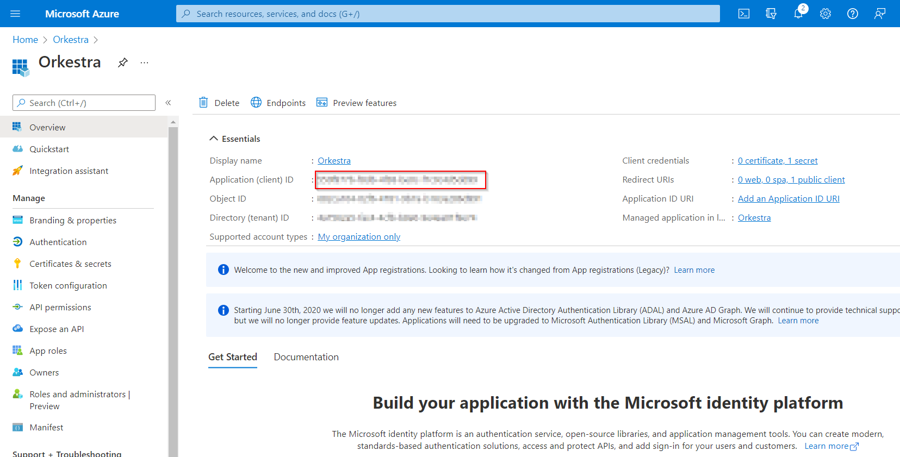
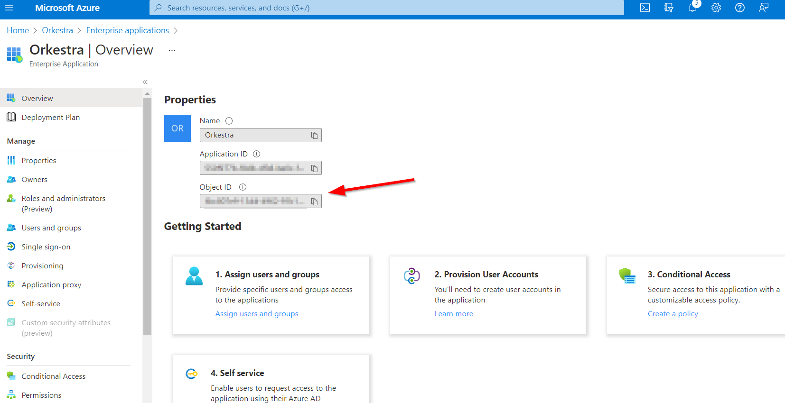

# App Registration

## Azure AD setup&#x20;

To enable SSO, you must first complete the setup on the Microsoft AAD.

### Register the App

1. In the Microsoft Azure portal, navigate to the "Azure Active Directory" service

.png>)

2 . Select App registration

.png>)

3 . And select "New Registration"

4 . Enter the following details :

.png>)

* Display name : Orkestra
* Redirect Uri type : Public client/native (mobile & desktop)
* Redirect Uri : [https://login.microsoftonline.com/common/oauth2/nativeclient](https://login.microsoftonline.com/common/oauth2/nativeclient)
* Click on **Register** button

5 .  Create new client secret&#x20;

6 . Go to API Permissions => Add a permission

6 .1 Select Microsoft Graph => application permissions

6 .2 Add the below permissions then click "Grant admin consent for Orkestra" :

## Orkestra Admin setup

&#x20;Open Orkestra with an admin account ,and go to SSO console

Enter the following details&#x20;

.png>)

1. &#x20;Organization Name : Your organization name (ex : Orkestra)
2. Tenant id : Go to your app registration overview => Directory(tenant) ID

3\. Client id : Go to your app registration overview => Application (client) ID

4\. Entreprise App Object Id : Go to Entreprise applications => orkestra => overview =>Object ID

5\. App Secret : Paste your app secret previously created

6\. Admin Id : automaticallt filled

7\. Add all domains you want to authorize (ex: orkestra.online)

##
