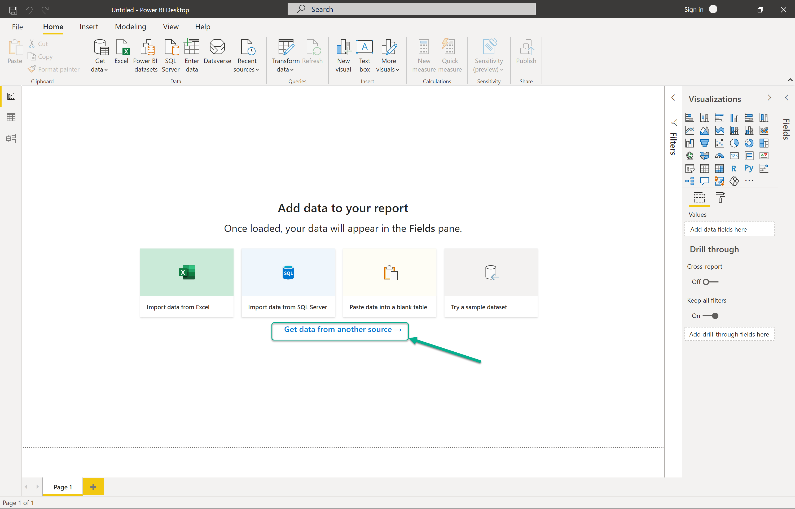
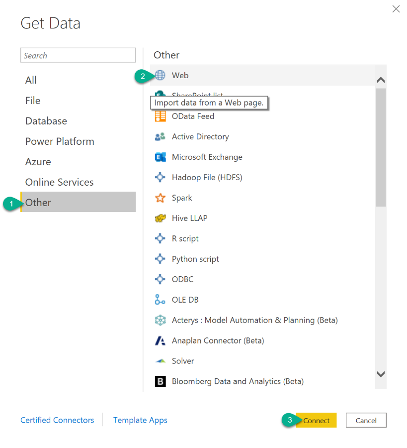
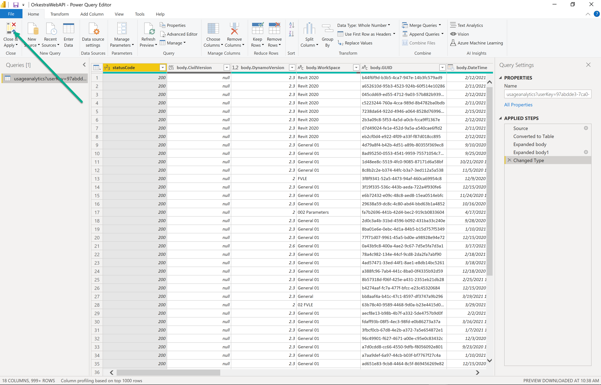

# Connecting Analytics to PowerBI

### In Orkestra

#### 1. Getting your PowerBI Url from the Account section of Orkestra

### In PowerBI

#### 1. Go to the opening screen of PowerBI and select “Get data from another source”

#### 2. Select “Other”, then “Web”, then “Connect”

#### 3. Paste the Url from your clipboard ans hit OK

#### 4. The response will be automatically recognized and converted to a table by PowerBI. You can hit “Close&Apply”

#### 5. Build your custom Dashboards!

## 

