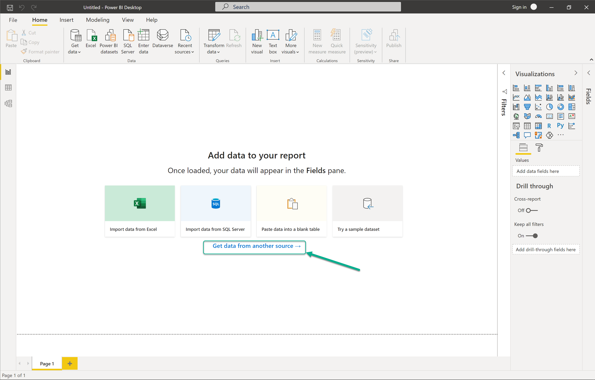
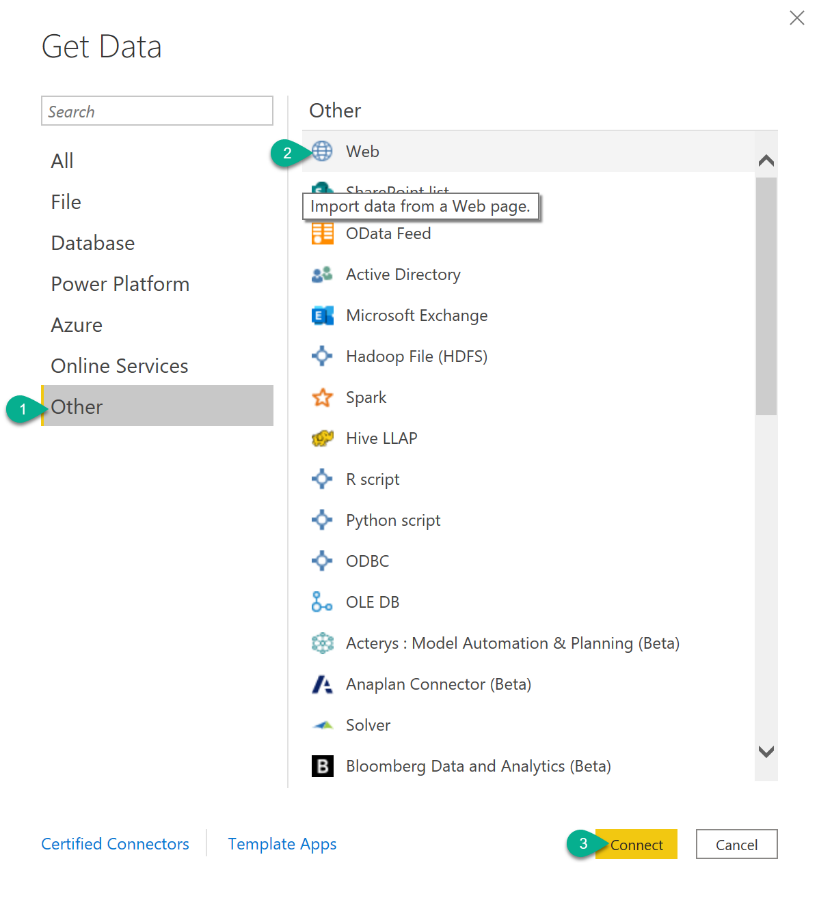

# Content Metrics

### In OrkestraIn Orkestra

#### 1. Getting your UserKey from the Account section of Orkestra

### In PowerBI

#### 1. Go to the opening screen of PowerBI and select “Get data from another source”

#### 2. Select “Other”, then “Web”, then “Connect”

#### 3. Paste the Url from your clipboard and hit OK

Enter the web request URL : <mark style="color:purple;">**https://api.orkestra.online/listcontent?userKey=**</mark><mark style="color:red;"><</mark><mark style="color:red;">**yourUserKey**</mark><mark style="color:red;">></mark>

#### 4. The response will be automatically recognized and converted to a table by PowerBI. You can hit “Close\&Apply”

#### 5. Build your custom Dashboards!

##
