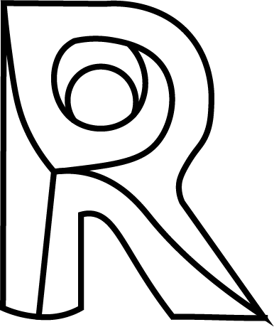

# What is free and what needs a subscription?

This page is to share a little known fact : Orkestra has a free tier that includes many useful features! 

Anyone can [download Orkestra](https://www.orkestra.online/orkestra-builds/) and enjoy all the Local features for free! This includes:

##   In Revit

* [The Local Player in Revit](orkestra-revit-addin/orkestra-local-player-tab.md)
* [Local QuickAccesses for Revit](orkestra-revit-addin/local-quickaccesses.md)
* [PlayLists ](orkestra-revit-addin/playlists.md)

##  In Dynamo

* [The Local Tab of the Orkestra View Extension](orkestra-dynamo-view-extension/orkestra-view-extension-local-tab.md)
* Local Node Snippets

##  In Civil 3D

* [The Local Player in Civil3D](orkestra-civil-3d-addin/orkestra-local-player-tab.md)
* [Local QuickAccesses for Civil3D](orkestra-civil-3d-addin/local-quickaccesses.md)

##  In Rhino

* The Local Player in Rhino

